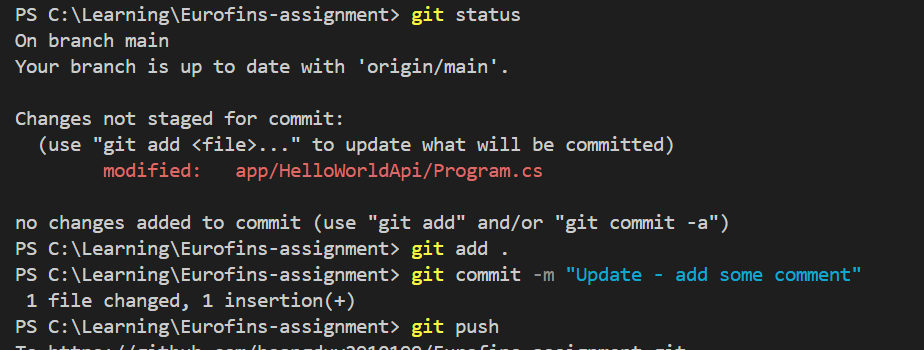

# Introduction
This is Eurofins Devops engineer assignment. The main purpose is to automate a build and deployement process of a simple helloword API application using GithubActions and Powershell scripting language.
# Project structure
```
    |--
        |-- .github # contains github action pipeline
        |-- app # contains application code
        |-- services # contains Windows services
        |-- script # contains scripts
        |-- docker # contains docker file
        |-- assets # contains related assets
```

*NOTE*: All of my work is available in a public GitHub repository - https://github.com/hoangduy2910199/Eurofins-assignment - for easier reference. The master file below provides a summary and status update for each assignment task.

| Task                            | Description                                                                                                                                                                                                                       | Status        |
|---------------------------------|-----------------------------------------------------------------------------------------------------------------------------------------------------------------------------------------------------------------------------------|---------------|
| Simple application and unit test | Use .Net core 8.0. Code is located in `./app/*` - [GitHub Link](https://github.com/hoangduy2910199/Eurofins-assignment/tree/main/app)                                                                                           |               |
| Build CI pipeline               | Use Github Action. Pipeline located in `./.github/workflows` - [GitHub Link](https://github.com/hoangduy2910199/Eurofins-assignment/tree/main/.github/workflows)                                                               | Done          |
| IIS deployment script           | Use Powershell, the script is in `./scripts/deploy-website.ps1` - [GitHub Link](https://github.com/hoangduy2910199/Eurofins-assignment/blob/main/scripts/deploy-website.ps1)                                                  | Done          |
| Status monitoring service       | Use .Net. The service is in `./services/HelloWorldMonitorService` - [GitHub Link](https://github.com/hoangduy2910199/Eurofins-assignment/tree/main/services/HelloWorldMonitorService)                                          | Done          |
| Windows service deployment script | Use Powershell. The script is in `./scripts/deploy-hello-monitor-service.ps1` - [GitHub Link](https://github.com/hoangduy2910199/Eurofins-assignment/blob/main/scripts/deploy-hello-monitor-service.ps1)                       | Done          |
| Docker image build              | Include in the pipeline at Step 1                                                                                                                                                                                                | Done          |
| Script to deploy Docker container | Use Bash script. The script is in `./scripts/deploy-container.sh` - [GitHub Link]() completed.                                                                                                                                                                                                                   | Not completed |


# CI/CD build
## CI/CD architecture diagram


## Implementation Steps:

| Step                    | Description                                               | Status        |
|-------------------------|-----------------------------------------------------------|---------------|
| Checkout code           | Getting latest code from main branch                       | Done          |
| Dependencies cache      | Cache dependencies from dotnet restore for build performance | Done          |
| Code quality check      | Check the code is optimized.                               | Done          |
| Unit test               | Use dotnet test                                           | Done          |
| Code security scan      | Use CodeSQ for security scan and report to Github Action dashboard | Done          |
| Build and publish application | Publish artifact to Github repo or Docker image to Dockerhub private repo. | Done          |
| Deploy Application      | Access to the host and run Powershell deployment script.  | Not implement |
| Deploy monitoring method| Access to the host and run Windows service deployment script. | Not implement |


## Example of running

1. Update code in app folder.

    

2. Pipeline is triggered. By default, the output will be an application artifact and pushed to Github registry.

    

3. Application Artifact is published

    

4. Code security scan report
    

5. If we would like to build a docker image, we'll trigger the workflow with *Image* publish-type option.

    

    

    

    

# Powershell script to deploy a .Net website
## The script includes the following steps:
- Create a user and group, and grant the appropriate permissions to the application pool identity.
- Create an application pool that runs under the created user.
- Create a website, import the certificate from a PFX file into the machine certificate store (Cert:\LocalMachine\My), and bind the certificate to the website.
- Set the log file path for the website.
- Publish the "hello" application to the specified physical path inside the website directory.
- Create the application under the website and associate it with the application pool.

## Example of running
    
        .\deploy-website.ps1 -Password "eurofins" -PfxPassword "eurofins" -BindingHost "localhosttest"
    


*Note*: above running is for self-signed certificate. In case of using public certificate, we need to specify the path of PFX file through "-PfxPath <cert_path>" and disable self signed certificate "-SelfSignedCertificate False".

# Powershell script to deploy monitoring service
## The script do the following steps:
- Create a User, grant permission on the service executable folder and the service log on right.
- Publish .Net service to a target folder.
- Create and start the service with the created user.

## Example of running
    
        .\deploy-hello-monitor-service.ps1 -CodePath "C:\Learning\Eurofins-assignment\services\HelloWorldMonitorService\" -Password "eurofins" -PublishFolder "C:\myService"
    

- Run script to deploy monitoring service.

    

- The service is running with specified user.

    

- The service is auto-start and recover after 300 second if failed.

    

- Log is written into status.txt file.

    

- When stop the IIS web app.

    

    

- Service stopped due to status != 200 OK

    

- Service auto-recover after 5 minutes.

    

    


# Bash script to deploy a Docker container
    
        ./deploy-container.sh 
        Enter Docker registry (e.g., registry.example.com): docker.io
        Enter username: duyphan28101997
        Enter password: Enter image name (e.g., myrepo/myimage:tag): duyphan28101997/helloworld-api:latest
        Enter container name: hello-api
        Enter port to expose (default 8080): 9783
    

## Example of running

