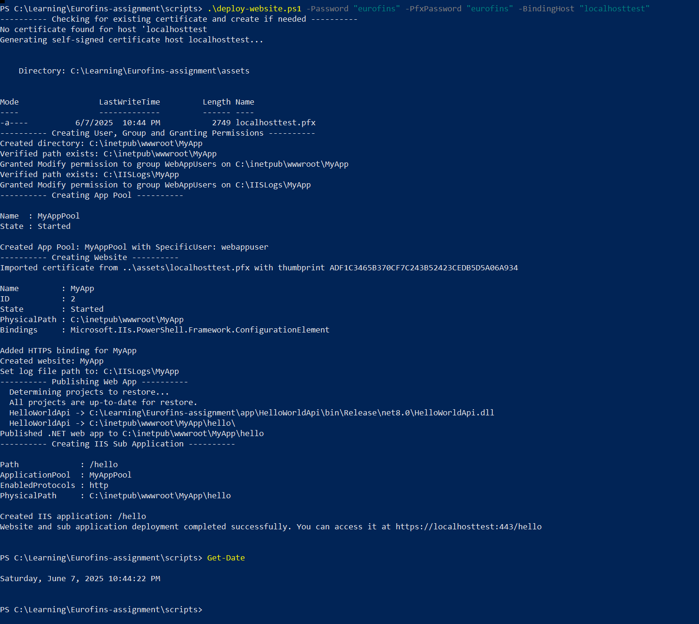
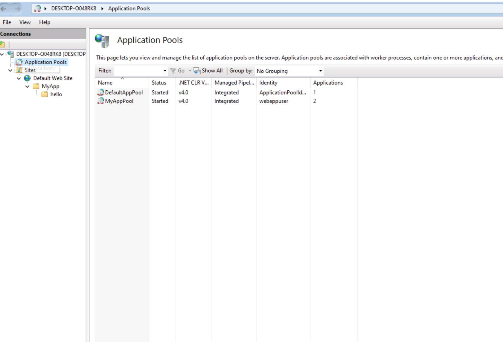
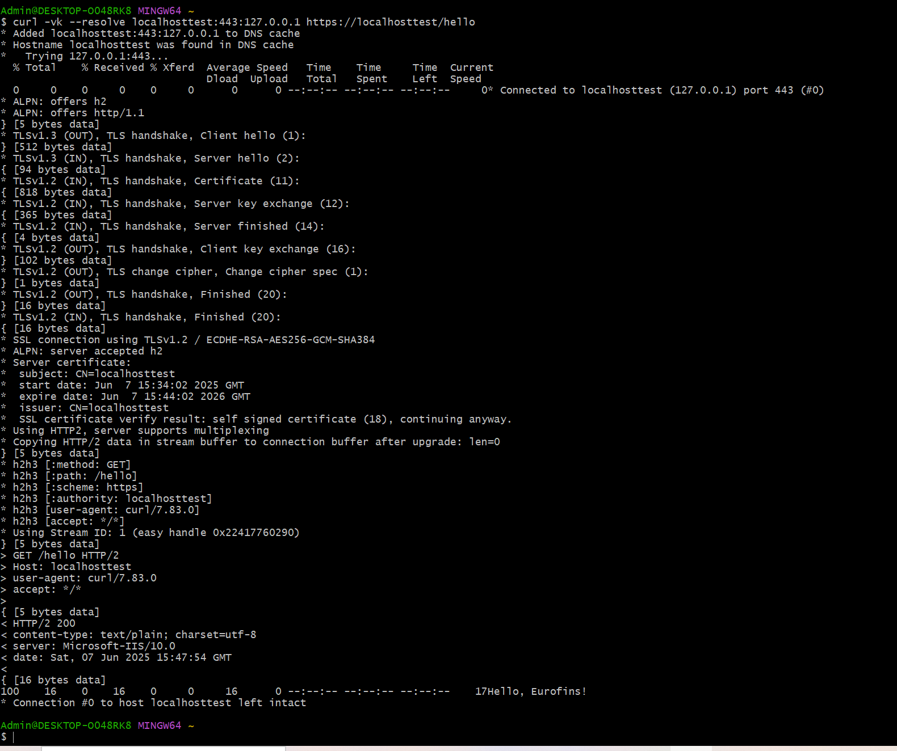

# Introduction
This is Eurofins Devops engineer assigment. The main purpose is to automate a build and deployement process of a simple helloword API application using Githubations and Powershell scripting language.
# Project structure
```
    |--
        |-- .github # contains github action pipeline
        |-- app # contains application code
        |-- artifact # contains appication zip
        |-- script # contains scripts
        |-- docker # contains docker file
```
# CI/CD build


# Powershell script to deploy a .Net website
## The script includes the following steps:
- Create a user and group, and grant the appropriate permissions to the application pool identity.
- Create an application pool that runs under the created user.
- Create a website, import the certificate from a PFX file into the machine certificate store (Cert:\LocalMachine\My), and bind the certificate to the website.
- Set the log file path for the website.
- Publish the "hello" application to the specified physical path inside the website directory.
- Create the application under the website and associate it with the application pool.

## Example of running
1. Generate a self signed certificate for https binding.
    ```
        $cert = New-SelfSignedCertificate -DnsName "localhost123" -CertStoreLocation ".\assets\" -FriendlyName "My Localhost Dev Cert" -NotAfter (Get-Date).AddYears(1)
        $pwd = ConvertTo-SecureString -String "<your_pass>" -AsPlainText -Force
        Export-PfxCertificate -Cert $cert -FilePath "C:\Learning\Eurofins-assignment\assets\localhost123.pfx" -Password $pwd # Export pfx file to /asset folder(just to centralize all resource and asset in this assignment into 1 repo. We should not store any certificate into repository in the real project)
    ```
2. Run the script to generate website with sub-application inside.
    ```
        .\deploy-website.ps1 -Password "eurofins" -PfxPassword "eurofins" -BindingHost "localhost123"
    ```
    
    
    